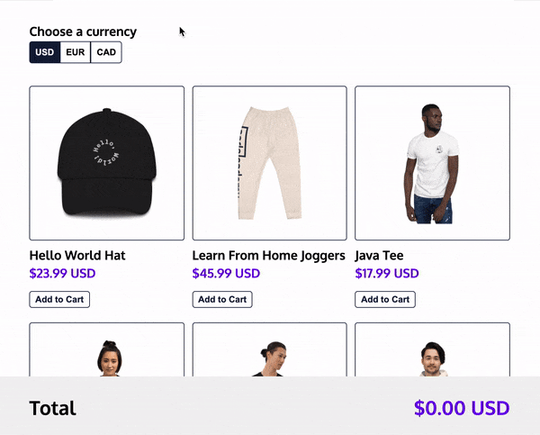

# Online Store

In this project, I built a frontend for an **online store**!
1. **The application displays products and allows the user to add them to their cart.** 
2. **In the cart, the user can adjust the quantity of each item and the running total will be displayed at the bottom.** 
3. **Lastly, the user can choose the currency for the entire application.**

FIND LIVE SITE HERE=> [ONLINE STORE](https://realgordon.github.io/codeacademy-store/)

